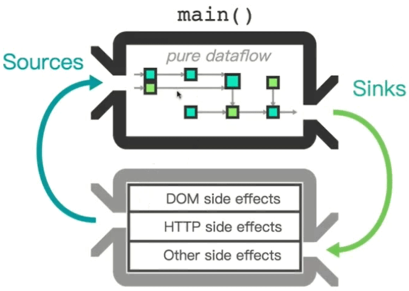

## Redux

`Redux` 是一套状态管理机制，所谓状态，就是影响 `UI` 变化的数据（`Angular` 中的 `ngrx` 本质上和 `react` 中的 `redux` 那一套是类似的）

一般在开发过程当中，状态都是一些状态碎片，存在各个的组件当中，碎片化的状态会给我们带来很大的困扰

所以我们可以使用 `Redux` 来进行状态的集中管理

`Redux` 是全局的，唯一的，不可改变的内存状态


* 不会改变自己原有的状态

* 每次会返回一个全新的状态

* 可以简单的想象为一个全局的内存数据库，它存储着应用中所有的状态（包括 `UI` 状态和数据状态等）


有三个关键概念 `Store`，`Action`，`Reducer`


有两个需要注意的地方

* `reducer` 是一个纯函数，可以接收到**任何** `Action`

* `reducer` 不会改变状态，只返回新的状态


## 简单的使用流程

代码详细地址可见 [index.reducer.ts](https://github.com/hanekaoru/Angular-Task/blob/master/src/app/reducers/index.ts)

首先需要一个 `index.reducer.ts` 来将散布的 `reducer` 进行汇总

```js
// reducers/index.reducer.ts
import { NgModule } from '@angular/core';

// 无论是 diapatch action 还是去 store 中取得最新的状态，都是通过这个去做的
// StoreModule -- redux 中的 store
import { ActionReducer, combineReducers, StoreModule } from '@ngrx/store';
import * as fromRouter from '@ngrx/router-store';

// ngrx 为路由提供的一个 store
// 它会把每次路由的变化做一个 reducer/state 的存储
// 所以可以通过这个 store 去取得当前变化的路由，也可以让其去发送一些 action，让我们导航到某一个路由上去
import { RouterStoreModule } from '@ngrx/router-store';

// 开发者工具
import { StoreDevtoolsModule } from '@ngrx/store-devtools';

// 开发环境判断
import { environment } from '../../environments/environment';

/**
 * compose 函数是一个很方便的工具，简单来说，它接受任意数量的函数作为参数，然后返回一个新的函数。
 * 这个新的函数其实就是前面的函数的叠加，比如说，我们给出 `compose(f(x), g(x))`, 返回的新函数
 * 就是 `g(f(x))`。
 */
import { compose } from '@ngrx/core/compose';
/**
 * storeFreeze 用于防止 state 被修改，在 Redux 中我们必须确保 state 是不可更改的，这个函数
 * 有助于帮我们检测 state 是否被有意或无意的修改了。当 state 发生修改时，会抛出一个异常，这一点
 * 在开发时非常有帮助。根据环境变量的值，发布时会不包含这个函数。
 */
// 利用 ngrx-store-freeze 来冻结状态，在开发过程中，如果写入了原有状态就会报错
import { storeFreeze } from 'ngrx-store-freeze';
/**
 * 分别从每个 reducer 中将需要导出的函数或对象进行导出
 */
import * as fromQuote from './quote.reducer';
// import * as ... from 


/**
 * 正如我们的 reducer 像数据库中的表一样，我们的顶层 state 也包含各个子 reducer 的 state
 * 并且使用一个 key 来标识各个子 state
 */
export interface State {
  quote: fromQuote.State;
  // ...
}

// 定义一个全局的 reducers，包含所有分支的 reducer
const reducers = {
  quote: fromQuote.reducer,
  // ...
};

// ngrx 提供了我们一个方法 combineReducers()，用于把所有的 reducers 进行合并后成为一个全局的 reducer
// combineReducers 接收一系列的 reducer 作为参数，然后创建一个新的 reducer
// 这个新的 reducer 接收到各 reducer 的值后，按 reducer 的 key 进行存储
// 把这个新的 reducer 想象成一个数据库，各个子 reducer 就像数据库中的表
// 所有 reducer 返回的其实都是一个 state
const developmentReducer: ActionReducer<State> = compose(storeFreeze, combineReducers)(reducers);
/**
 * 使用 combineReducers 把所有子 reducer 合并产生一个顶级 reducer
 */
const productionReducer: ActionReducer<State> = combineReducers(reducers);

const initState = {
  quote: fromQuote.initialState,
  // ...
};

// 利用 compose 来合并多个，原理是把前一个函数当作后一个函数的参数传递进去
// compose 函数是一个很方便的工具，简单来说，它接受任意数量的函数作为参数，然后返回一个新的函数
// 这个新的函数其实就是前面的函数的叠加，比如说，我们给出 `compose(f(x), g(x))`, 返回的新函数就是 `g(f(x))`
// 在合并前，用 ngrx-store-freeze 来对 reducers 做一个保护
// storeFreeze 用于防止 state 被修改，在 Redux 中我们必须确保 state 是不可更改的，这个函数
// 有助于帮我们检测 state 是否被有意或无意的修改了，当 state 发生修改时，会抛出一个异常，这一点
// 在开发时非常有帮助，根据环境变量的值，发布时会不包含这个函数
// const developmentReducers: ActionReducer<any> = compose(storeFreeze, combineReducers)(reducers);
export function reducer(state: any, action: any) {
  // 根据开发环境来进行判断
  // 处理完成以后在放入下面的 StoreModule.provideStore() 当中
  if (action.type === authActions.ActionTypes.LOGOUT) {
    return initState;
  }
  if (environment.production) {
    return productionReducer(state, action);
  } else {
    return developmentReducer(state, action);
  }
}

@NgModule({
  imports: [
    // 这里传递的 reducer 应该是整个应用的全局性的 reducer
    // StoreModule.provideStore  仅需引入一次，请把它包含在根模块或者 CoreModule 中
    // 我们这里为了方便组织，新建了一个 AppStoreModule，但也是只在 CoreModule 中引入的
    StoreModule.provideStore(reducer),
    RouterStoreModule.connectRouter(),
    // DevTool 需要在 StoreModule 之后导入
    StoreDevtoolsModule.instrumentOnlyWithExtension()
  ]
})

export class AppStoreModule {
}
```

下面是 `quote.reducer.ts`

```js
// reducers/quote.reducer.ts
import { Quote } from '../domain';
import * as actions from '../actions/quote.action';

// 当前 State
export interface State {
  quote: Quote;
}

// 当前 State 的初始值
export const initialState: State = {
  quote: {
    cn: 'AAA',
    en: 'BBB',
    pic: 'CCC',
  }
};

export function reducer(state: State = initialState, action: actions.Actions): State {
  switch (action.type) {
    case actions.ActionTypes.QUOTE_SUCCESS:
      // 希望 payload 返回一个 state，然后利用这个 state 来返回一个新的 state
      // 相当于 return Object.assign({}, state, {quote: action.payload})
      // 因为我们导入的类型是 actions.Actions，它是一个并集，包含 Quote 和 string
      // 所以这里需要做一个强制类型转换 <Quote>
      return { ...state, quote: action.payload };
    // 失败的话和默认的是一样的，直接返回一个原有的 state，不会做任何变化
    case actions.ActionTypes.QUOTE_FAIL:
    default:
      return state;
  }
}

// 解决 state.quote.quote 这样的情况
// 接收一个 state，返回一个 state.quote
export const getQuote = (state: State) => state.quote;
```

下面是 `quote.reducer.ts` 依赖的 `action`

```js
// actions/quote.action
import { Action } from '@ngrx/store';
import { type } from '../utils/type.util';
import { Err, Quote } from '../domain';

// 将 action 的 type 从一个字符串变为了一个字典类型的对象
// 然后使用工具函数 type() 将其转换为一个类型
// [...] 用中括号表明是哪一个 reducer，后面跟着的是描述
export const ActionTypes = {
  QUOTE: type('[Quote] Quote'),
  QUOTE_SUCCESS: type('[Quote] Quote Success'),
  QUOTE_FAIL: type('[Quote] Quote Fail')
};

// 一个实现 Action 接口的类，所以应当有 type 与 payload
export class QuoteAction implements Action {
  type = ActionTypes.QUOTE;

  constructor(public payload: any) {
  }
}

export class QuoteSuccessAction implements Action {
  type = ActionTypes.QUOTE_SUCCESS;

  constructor(public payload: Quote) {
  }
}

export class QuoteFailAction implements Action {
  type = ActionTypes.QUOTE_FAIL;

  // 希望将错误信息返回，所以是一个 string 类型
  constructor(public payload: string) {
  }
}

// 最后导出一个 Actions 的集合，它会把我们定义好的 action 用 | 连接起来
export type Actions
  = QuoteAction
  | QuoteSuccessAction
  | QuoteFailAction;
```

然后在使用的地方只需要调用 `store` 的 `dispatch` 方法，然后传递相应的 `payload` 即可

```js
// login/login.component

// ...

constructor(
  // ...
) {
  this.quote$ = this.store$.select(fromRoot.getQuote);
  // 需要注意，现在逻辑还是书写在组件当中的
  // 下面可以使用 effect() 来将逻辑剥离出去
  this.quoteService$.getQuote()
    .subscribe(q => {
      this.store$.dispatch(new actions.QuoteAction(q))
    })
}
```

以上就是 `redux` 整个的使用流程，下面来看看 `effect`


## Effect

`Effect` 是针对于外部的一些影响和改变，简单来说就是

同样一个 `action` 传递过来之后，可以在 `reducer` 当中去影响与 `UI` 相关的一些状态

但是有一些状态又与 `UI` 不相关，但是它是外部的一些变化，比如说与服务器之间的通讯，这些东西我们称之为 `Effect`

我们希望通过一个 `action` 流可以把 `reducer` 和 `effect` 统一管理起来，这也就是使用 `ngrx` 的好处，可以**把逻辑完全从组件当中剥离出来**



从 `action` 的角度来看，`action` 在 `reducer` 当中，接收到 `action` 信号以后，改变的是一个纯的数据流

还有的时候会接收到一个信号，它其实并不改变数据，它改变的是外部的状态，比如发送了一个 `http` 请求或者是做了一些 `DOM` 方面的更改

也就是说如果我们把 `action` 看成为一个流的话，那么对于和 `UI` 相关的数据的一些处理当成 `reducer`

而针对于 `UI` 相关状态之外的一些改变就叫做 `effect`，这样一来，我们的系统就分为 `reducer` 和 `effect`

也就是说，一个 `action` 出来之后，它可能会改变数据的状态，也可能会带来一些外部的影响，这些影响处理完之后，可能又会产生一个新的 `action`，这样循环往复，而且可以任意拼接

简单来说就是，对于某个 `effect`，我们在处理完毕以后希望它可以继续去处理另外的一个 `effect` 或者是处理某个状态

所以我们可以在它处理完毕以后，让其发射出另外一个 `action`，这样一来整个系统就可以形成一套非常灵活的处理逻辑的信息流


## 创建 Effect

首先创建一个执行文件，用来执行 `effect`

```js
// effects/index.ts
import { NgModule } from '@angular/core';
import { EffectsModule } from '@ngrx/effects'

@NgModule({
  // 有一个静态的 run() 方法
  // 可以把我们建立起来的 effects 全部 run 起来
  imports: [
    EffectsModule.run()
  ]
})

export class AppEffectsModule {}
```

然后来写具体的 `effect` 逻辑

```js
// effects/quote.effects.ts
import { Injectable } from '@angular/core';
import { Actions, toPayload, Effect } from '@ngrx/effects';
import { Observable } from 'rxjs/Observable';
import { Action } from '@ngrx/store';
import * as actions from '../actions/quote.action';
import { QuoteService } from '../service/quote.service';

@Injectable()
export class QuoteEffects {

  // 使用装饰器来进行标记
  // effect 也是一个流，并且其类型为 Action 的一个流
  @Effect()
  quote$: Observable<Action> = this.actions$  // -- ①
    // 是 Actions 流中的一个操作符（也是一个 Observable，但是里面定义了一些自己的操作符）
    .ofType(actions.ActionTypes.LOAD)  // -- ②
    // 取得 action，简写语法，等同于 .map(a => a.payload)
    .map(toPayload)
    // 这个 action 并不关心其 payload
    .switchMap(_ => this.service$.getQuote()  // -- ③
      // 成功的时候，发送一个成功的 action
      .map(q => new actions.LoadSuccessAction(q))  // -- ④
      // 如果失败，发射一个失败的 action
      .catch(err => Observable.of(new actions.LoadFailAction(JSON.stringify(err))))  // -- ⑤
    )

  constructor(
    private actions$: Actions,
    private service$: QuoteService
  ) {}
  
}
```

大致的逻辑如下

* 首先监听 `actions$` 这个流（①）

* 然后捕获到 `LOAD` 这个信号流（②）

* 然后调用 `service` 当中的 `getQuote()` 方法（③）

* 成功的时候继续发射一个加载成功的 `action`（④）

* 失败的时候发射一个加载失败的 `action`（⑤）

定义好 `effects` 之后，我们在组件当中调用 `service` 的步骤就可以去掉了，因为我们在 `effects` 当中已经进行处理了

使用 `effect` 以后可以看出，我们在处理完一个逻辑之后，可以将其转发到另外一个 `action` 上去，轻而易举的就可以实现逻辑的拼接

使用 `effect` 之后，我们就可以来改写上面的例子，将逻辑部分完全的剥离出去

```js
// login/login.component

// ...

constructor(
  // ...
) {
  this.quote$ = this.store$.select(fromRoot.getQuote);
  // 直接 dispatch 即可，因为逻辑已经放到 effect 当中进行处理了
  this.store$.dispatch(new actions.QuoteAction(null))
}
```
