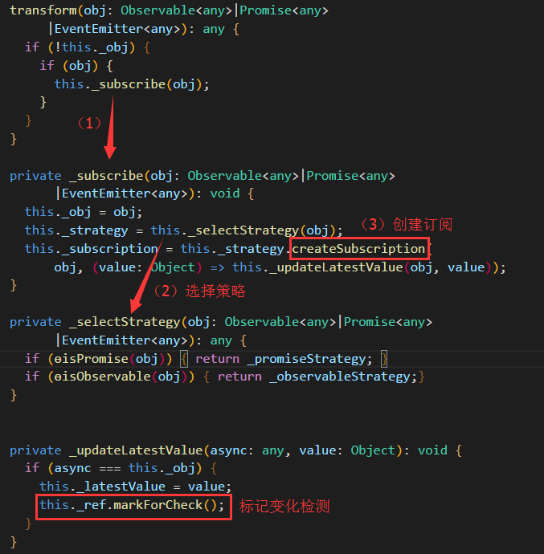
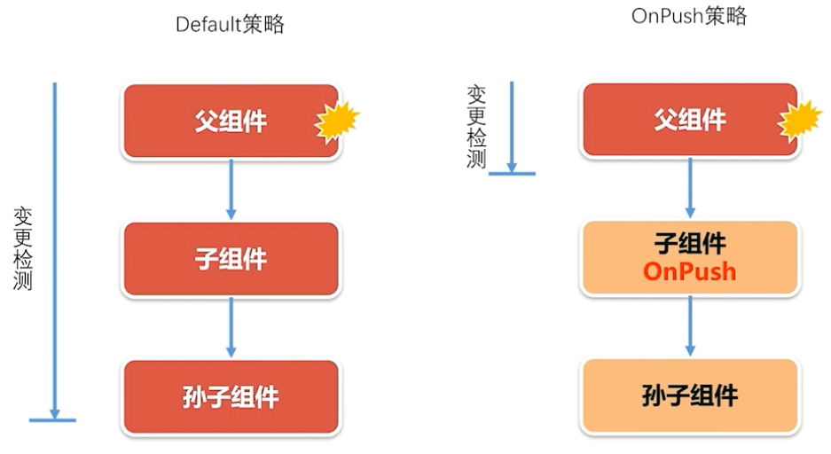

## 数据绑定

主要分为 `HTML` 属性绑定和 `DOM` 绑定

#### DOM 绑定

就是一般经常看到的事件绑定等（`(click)="..."`）

#### HTML 绑定

* 基本 `HTML` 属性绑定

```html
<td [attr.colspan]="tableColspan"></td>
```

* `CSS` 类绑定

一般用于控制 `HTML` 元素上的 `class` 的值

```html
<div class="aaa bbb" [class]="someExpression"></div>

<div [class.special]="isSpecial"></div>

<div [ngClass]="{aaa: isA, bbb: isB}"></div>
```

* 样式绑定

和 `CSS` 类绑定类似，不过其控制的是样式

```html
<button [style.color]="isSpecial ? 'red' : 'pink'"></button>

<button [ngStyle]="{'font-size': this.canSave ? 'italic' : 'normal'}"></button>
```

#### HTML 属性和 DOM 属性的关系

* 少量 `HTML` 属性和 `DOM` 属性之间有着 `1：1` 的映射关系，比如 `id`

* 有些 `HTML` 属性没有对应的 `DOM` 属性，如 colspan

* 有些 `DOM` 属性没有对应的 `HTML` 属性，如 textContent

* 就算名字相同，`HTML` 属性和 `DOM` 属性也不是同一样东西

* `HTML` 属性的值指定了初始值，`DOM` 属性的值表示当前值

  * `DOM` 属性的值可以改变

  * `HTML` 属性的值不能改变

* 模版绑定是通过 `DOM` 属性和事件来工作的，而不是 `HTML` 属性


## @ViewChild()

通过 `@ViewChild()` 装饰器可以获得子组件的引用，从而可以在父组件当中来直接调用子组件的方法

```js
// 父组件
<app-header #child1></app-header>

export class AppComponent implements OnInit{

  @ViewChild('child1')
  child1: HeaderComponent;

  ngOnInit() {
    this.child1.run(`222`);
  }
}

// 子组件
export class HeaderComponent implements OnInit {
  constructor() { }
  ngOnInit() { }

  run(name) {
    console.log(name);
  }
}
```

#### @ViewChild 使用类型查询

```js
// child.component.ts
import { Component, OnInit } from '@angular/core';

@Component({
    selector: 'exe-child',
    template: `
      <p>Child Component</p>  
    `
})
export class ChildComponent {
  name: string = 'child-component';
}


// app.component.ts
import { Component, ViewChild, AfterViewInit } from '@angular/core';
import { ChildComponent } from './child.component';

@Component({
  selector: 'my-app',
  template: `
    <h4>Welcome to Angular World</h4>
    <exe-child></exe-child>
  `,
})
export class AppComponent {

  // 通过 @ViewChild() 来获取子组件
  @ViewChild(ChildComponent)
  childCmp: ChildComponent;

  ngAfterViewInit() {
    console.dir(this.childCmp);
  }
}
```


#### ViewChildren

`ViewChildren` 用来从模版视图中获取匹配的多个元素，返回的结果是一个 `QueryList` 集合

```js
import { Component, ViewChildren, QueryList, AfterViewInit } from '@angular/core';
import { ChildComponent } from './child.component';

@Component({
  selector: 'my-app',
  template: `
    <h4>Welcome to Angular World</h4>
    <exe-child></exe-child>
    <exe-child></exe-child>
    <exe-child></exe-child>
  `,
})
export class AppComponent {

  @ViewChildren(ChildComponent)
  childCmps: QueryList<ChildComponent>;

  ngAfterViewInit() {
    console.dir(this.childCmps);
  }
}
```

运行之后可以在控制台当中看到输出多个 `ChildComponent`


#### 小结

* `ViewChild` 装饰器用于获取模板视图中的元素，它支持 `Type` 类型或 `string` 类型的选择器

* 同时支持设置 `read` 查询条件，以获取不同类型的实例

* `ViewChildren` 装饰器是用来从模板视图中获取匹配的多个元素，返回的结果是一个 `QueryList` 集合


## ng-content

作用同 `vue` 当中的 `slot` 插槽

子组件可以使用 `<ng-content></ng-content>` 来获取父组件当中定义在子组件内部的内容

需要注意：只能绑定父组件当中的属性

```html
// 父组件
<app-child>
  <div>这是父组件传递的内容</div>
</app-child>


// 子组件
<div>这是子组件</div>
<`ng-content`></`ng-content`>
```

也可以使用 `select` 选择器来指定具名插槽

```html
// 父组件
<app-child>
  <div class="header">这是父组件传递的内容</div>
</app-child>


// 子组件
<div>这是子组件</div>
<`ng-content` select=".header"></`ng-content`>
```

#### @ContentChild 和 @ContentChildren

* `ContentChild` 是属性装饰器，用来从通过 `Content Projection` 方式设置的视图中获取匹配的元素

* `ContentChildren` 属性装饰器用来从通过 `Content Projection` 方式设置的视图中获取匹配的多个元素，返回的结果是一个 `QueryList` 集合

#### ContentChild 与 ViewChild 的异同点

相同点

* 都是属性装饰器

* 都有对应的复数形式装饰器：`ContentChildren`、`ViewChildren`

* 都支持 `Type<any>` | `Function` | `string` 类型的选择器

不同点

* `ContentChild` 用来从通过 `Content Projection` 方式 (`ng-content`) 设置的视图中获取匹配的元素

* `ViewChild` 用来从模板视图中获取匹配的元素

* 在父组件的 `ngAfterContentInit` 生命周期钩子中才能成功获取通过 `ContentChild` 查询的元素

* 在父组件的 `ngAfterViewInit` 生命周期钩子中才能成功获取通过 `ViewChild` 查询的元素


## 响应式编程

* 可观察对象 `Observable`（流）

  * 表示一组值或者事件的集合

* 观察者 `Observer`

  * 一个回调函数集合，它知道怎样去监听被 `Observable` 发送的值

* 订阅 `Subscription`

  * 表示一个可观察对象，主要用于取消注册

* 操作符 `Operators`

  * 纯粹的函数，使开发者可以以函数编程的方式处理集合

一个简单的示例

```js
var subscription = Observable.from([1, 2, 3, 4])
  .filter((e) => e % 2 === 0)
  .map((e) => e * e)
  .subscribe(val => console.log(val))
```


## 管道

```html
<p>生日是 {{ birthday | data: 'yyyy-MM-dd' }}</p>

<p>圆周率为 {{ 3.14159265 | number: '1.2-2' }}</p>

<p>转为大写 {{ 'Angular' | uppercase }}</p>

<p>转为小写 {{ 'Angular' | lowercase }}</p>

<p>格式化 {{ { name: 'semlinker' } | json }}</p>
```

#### 管道参数

管道可以接收任意数量的参数，使用方式是在管道名称后面添加 ` : ` 和参数值

如 `number: '1.2-2'` ，若需要传递多个参数则参数之间用冒号隔开

```html
<p>{{ 'semlinker' | slice:0:3 }}</p>
```

#### 管道链

可以将多个管道连接在一起，组成管道链对数据进行处理

```js
<p>{{ 'semlinker' | slice:0:3 | uppercase }}</p>
```

#### 自定义管道

管道是一个带有管道元数据装饰器的类，与组件和模块类似，就是一个简单的 `TypeScript` 类

通过 `@pipe` 装饰器来告诉 `Angular` 这是一个管道类，然后去实现 `PipeTransform` 接口即可

一个简单的管道，如果跟随参数，则返回和参数相乘的值，如果没有传递参数，则返回原值

```js
import { Pipe, PipeTransform } from '@angular/core';

@Pipe({
  name: 'formatNumber'
})

export class TestPipe implements PipeTransform {

  transform(value: number, args?: number): any {
    if (!args) {
      args = 1;
    }
    return value * args;
  }

}
```

然后使用也很简单

```html
<div>{{num | formatNumber: '2'}}</div>
```


#### 一个小技巧：在构造函数当中使用管道

```js
import { DatePipe } from '@angular/common';

class MyService {

  constructor(private datePipe: DatePipe) {}

  transformDate(date) {
    this.datePipe.transform(myDate, 'yyyy-MM-dd');
  }
}
```

#### AsyncPipe（异步管道）

使用 `AsyncPipe` 可以直接在模版当中使用 `Promise` 和 `Observable` 对象

而不需要通过定义一个类的成员属性来存储返回的结果

两个例子，`Promise` 和 `Observable`

```js
// Promise
import { Component } from '@angular/core';

@Component({
  selector: 'exe-promise-pipe',
  template: `
    <h4>Promise with AsyncPipeComponent</h4>
    <p>{{ promise | async }}</p>
  `
})
export class PromiseAsyncPipeComponent {
  promise: Promise<string>;
  constructor() {
    this.promise = this.getPromise();
  }

  getPromise(): Promise<string> {
    return new Promise((resolve, reject) => {
      setTimeout(() => {
        resolve('Promise with AsyncPipe complete!');
      }, 2000);
    });
  }
}


// Observables
import { Component } from '@angular/core';
import { Observable } from 'rxjs/Rx';

@Component({
  selector: 'exe-observable-pipe',
  template: `
    <h4>Observable with AsyncPipe Component</h4>
    <p>{{ observable | async }}</p>
  `
})
export class ObservableAsyncPipeComponent {
  observable: Observable<number>

  constructor() {
    this.observable = this.getObservable();
  }

  getObservable(): Observable<number> {
    return Observable
      .interval(1000)
      .take(10)
      .map(v => v * v);
  }
}
```


#### 两者的区别

* `Promise`

  * 返回单个值

  * 不可取消的

* `Observable`

  * 随着时间的推移发出多个值

  * 可以取消的

  * 支持 `map`、`filter`、`reduce` 等操作符

  * 延迟执行，当订阅的时候才会开始执行

#### AsyncPipe 会发送多次请求

比如如下情况

```js
@Component({
  selector: 'exe-app',
  template: `
   <div>
      <p>{{ (person$ | async)?.id }}</p>
      <p>{{ (person$ | async)?.title }}</p>
      <p>{{ (person$ | async)?.body }}</p>
    </div>
  `
})
```

几种解决办法

* 使用 `share()`

```js
// 使用 rxjs 中的共享操作符
this.http.get(url)
  .map(res => res.json()).share()
```

* 使用 `publishReplay()`

但是页面当中如果有按钮存在的情况，再次请求同样的地址还是会发送请求，这时可以使用 `publishReplay()`

```js
constructor(private http: Http) {
  this.preparePersonInfo();
}

ngOnInit() {
  // 调用 connect() 方法的时候，将主动执行订阅操作
  this.person$.connect();
}

// 调用 publishReplay() 方法后将返回一个 ConnectableObservable 对象
preparePersonInfo() {
  this.person$ = this.http.get(url)
  .map(res => res.json())
    .publishReplay()
}
```

* 如果只需要从服务器获取数据并显示数据

可以使用 `Promise` 来修复 `AsyncPipe` 发送多次请求的问题

```js
this.person = this.http.get(url)
 .map(res => res.json()).toPromise()
```

#### AsyncPipe 执行流程

如下图




## 组件间的参数传递

向组件传递数据的方式有下面几种

* 通过输入属性（`@Input`）

通过属性来传递数据，并且这种传递只能在有父子关系的组件当中，由父组件来向子组件传递数据

* 另外一种是通过路由参数

一个简单的示例

```js
// 父组件
<app-header (lastPrice)="lastPriceHandle($event)"></app-header>
<div>父组件的数据：{{fatherPrice | number: '2.2-2'}}</div>

import { Component } from '@angular/core';

export class AppComponent {

  fatherPrice: number;

  lastPriceHandle(e) {
    this.fatherPrice = e;
  }
}

// 子组件
<div>子组件的数据：{{price | number: '2.2-2'}}</div>

import { Component, OnInit, Output, EventEmitter } from '@angular/core';

export class HeaderComponent implements OnInit {

  price: number;

  @Output()
  lastPrice: EventEmitter<any> = new EventEmitter();

  constructor() {
    setInterval(() => {
      this.price = Math.random() * 100;
      this.lastPrice.emit(this.price);
    }, 1000);
  }

  ngOnInit() {
  }
}
```


## 生命周期

#### 组件初始化

* `constructor`（*）

* `ngOnChanges`

  * 只有在输入属性（`@Input`）变化时才会被调用

  * 如果是可变**对象**的属性发生了变化（引用自身不发生变化），不会触发 `ngOnChanges` 事件，但是传递的数据仍是可用的

* `ngOnInit`（*）

* `ngDoCheck`

  * 上面四个钩子分为**第一个阶段**，主要是属性的初始化

* `ngAfterContentInit`（*）

* `ngAfterContentChecked`

  * 上面两个钩子都是跟插槽相关的，为**第二个阶段**

  * 属性初始化之后，接着就会先渲染插槽的内容，插槽的内容渲染完毕后会调用这两个方法

  * 在这之后为**第三个阶段**，会去调用**子组件**的一系列钩子（如果有的话，也会去执行这一整套流程）

  * 到这里以后，整个的组件的视图组装完毕以后，就回去调用下面两个方法，为**第四个阶段**

* `ngAfterViewInit`（*）

  * 只会在初始化完毕之后调用一次，在组件的视图已经被组合好之后触发

  * 不要在这两个方法之中去改变视图中绑定的东西
  
  * 如果非要改变，解决办法就是可以将操作放到异步操作之中，比如 `setTimeout()`

  * 如果有子组件，那么只有当所有子组件的视图都组装完毕以后，父组件的这两个方法才会被调用

* `ngAfterViewChecked`

  * 特性同 `ngAfterViewInit` 一致，但是调用是在 `ngAfterViewInit` 之后

  * 上面最后两个方法调用完毕之后，整个组件的初始化工作就完毕了，就会呈现视图给用户了

  * 用户任意的操作反馈都会触发 `Angular` 的变化检测机制，会调用下面四个方法检查变化


需要注意，带有 `check` 的钩子在程序运行的时候调用是十分频繁的，所以需要谨慎操作


#### 变化检测

* `ngOnChanges`

* `ngDoCheck`

* `ngAfterContentChecked`

* `ngAfterViewChecked`


#### 组件销毁

* `ngOnDestroy`（*）

  * 路由切换的时候会被调用，销毁之前的组件，加载新的组件

  * 一般去在这个钩子当中销毁一些引用的资源，比如清除定时器等


使用生命周期钩子，可以在特定的组件的生命周期事件发生时执行你需要的业务逻辑

标注 `*` 的方法只会被调用一次，而没被标记的方法则会被多次调用

需要注意的是，在变化检测当中执行的方法和组件初始化当中的方法是一样的（所有总共有九个生命周期钩子）


#### 变化检测机制

`Angular` 的变化检测机制是由 `zone.js` 来实现的

主要的目的是保证组件的属性变化和页面的变化是同步的，浏览中发生的任何异步事件都会触发变更检测

一个 `Angular` 应用就是以一个主组件为根的组件树，当 `Angular` 应用运行的时候

每一个组件都会生成一个属于它自己的变更检测器，当任何一个变更检测器检测到变化

`zone.js` 就会根据组件的变更检查策略来检查组件，以检测组件是否更新它的模版

`Angular` 实现了两个变更检测策略，`Default` 和 `OnPush`

#### Default

如果所有的组件都使用 `Default` 策略，那么变更不管发生在哪个组件上， `zone.js` 都会检查整个组件树

如果其中有一个特定的组件声明了自己的变更策略是 `OnPush`，那么只有当这个组件的输入属性发生变化的时候

`zone.js` 才会检测这个组件及其子组件，大致如下图所示




## 生命周期钩子补充

首先基于指令与组件的区别来分个类

* 指令与组件共有的钩子

  * `ngOnChanges`

  * `ngOnInit`

  * `ngDoCheck`

  * `ngOnDestroy`

* 组件特有的钩子

  * `ngAfterContentInit`

  * `ngAfterContentChecked`

  * `ngAfterViewInit`

  * `ngAfterViewChecked`


#### 作用以及调用顺序

* `ngOnChanges` - 当数据绑定输入属性的值发生变化时调用

* `ngOnInit` - 在第一次 `ngOnChanges` 后调用

* `ngDoCheck` - 自定义的方法，用于检测和处理值的改变

* `ngAfterContentInit` - 在组件内容初始化之后调用

* `ngAfterContentChecked` - 组件每次检查内容时调用

* `ngAfterViewInit` - 组件相应的视图初始化之后调用

* `ngAfterViewChecked` - 组件每次检查视图时调用

* `ngOnDestroy` - 指令销毁前调用


#### constructor

组件的构造函数会在所有的生命周期钩子之前被调用，它主要用于依赖注入或执行简单的数据初始化操作


#### ngOnChanges

当数据绑定输入属性的值发生变化的时候，`Angular` 将会主动调用 ngOnChnages 方法

它会获得一个 `SimpleChange` 对象，包含绑定属性的新值和旧值，主要用于监测组件输入属性变化

```js
// app.component.ts
import { Component } from '@angular/core';

@Component({
  selector: 'my-app',
  template: `
    <h4>Welcome to `Angular` World</h4>
    <exe-child name="exe-child-component"></exe-child>
  `,
})
export class AppComponent { }


// child.component.ts
import { Component, Input, SimpleChanges, OnChanges } from '@angular/core';

@Component({
    selector: 'exe-child',
    template: `
      <p>Child Component</p>  
      <p>{{ name }}</p>
    `
})
export class ChildComponent implements OnChanges{
    @Input()
    name: string;

    `ngOnChanges`(changes: SimpleChanges) {
        console.dir(changes);
    }
}
```

运行代码后会发现控制台中会输出 `currentValue` 和 `previousValue` 的值

> 非常类似与 `Vue` 当中的 `watch` 方法，监听某个属性，可以获取其的新值和旧值

```js
watch: {
  visible(curVal, oldVal) {
    if (curVal) {
      // ...
    } else {
      // ...
    }
  }
},
```

#### ngOnInit

在第一次 `ngOnChanges` 执行之后调用，并且只被调用一次

它主要用于执行组件的其它初始化操作或**获取组件输入的属性值**

```js
import { Component, Input, OnInit } from '@angular/core';

@Component({
  selector: 'exe-child',
  template: `
    <p>父组件的名称：{{pname}} </p>
  `
})
export class ChildComponent implements OnInit {
  @Input()
  pname: string; // 父组件的名称

  constructor() {
    console.log('ChildComponent constructor', this.pname); // Output：undefined
  }

  `ngOnInit`() {
    console.log('ChildComponent `ngOnInit`', this.pname); // Output: 输入的 pname 值
  }
}
```

#### ngOnDestory

在指令被销毁前，将会调用 `ngOnDestory` 方法，主要用于执行一些清理操作

比如移除事件监听、清除定时器、退订 `Observable` 等

#### `ngDoCheck`

当组件的输入属性发生变化时，将会触发 `ngDoCheck` 方法

可以使用该方法自定义我们的检测逻辑，它也可以用来加速我们变化检测的速度

> 带有 `Check` 的钩子会被调用的十分频繁（见上方），所以谨慎使用

#### `ngAfterContentInit`

在组件使用 `ng-content` 指令的情况下，`Angular` 会在将外部内容放到视图后用

它主要用于获取通过 `@ContentChild` 或 `@ContentChildren` 属性装饰器查询的内容视图元素

#### `ngAfterContentChecked`

在组件使用 `ng-content` 指令的情况下，`Angular` 会在检测到外部内容的绑定或者每次变化的时候调用

> 在没使用 `ng-content` 指令的情况下，`ngAfterContentChecked` 也会被调用

#### `ngAfterViewInit`

在组件相应的视图初始化之后调用，它主要用于获取通过 `@ViewChild` 或 `@ViewChildren` 属性装饰器查询的视图元素

#### `ngAfterViewChecked`

组件每次检查视图时调用