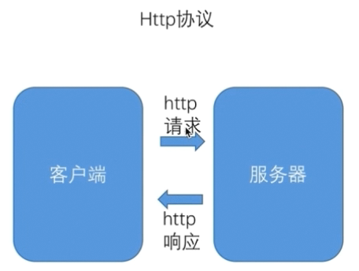
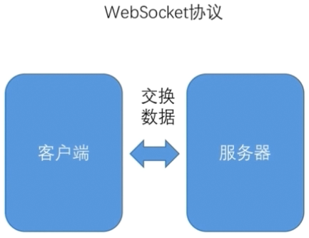

## Input

`Input` 是属性装饰器，用来定义组件内的输入属性，一般用来实现父组件向子组件传递数据


#### @Input()  

```js
// counter.component.ts
import { Component, Input } from '@angular/core';
@Component({
    selector: 'exe-counter',
    template: `
      <p>当前值: {{ count }}</p>
      <button (click)="increment()"> + </button>
      <button (click)="decrement()"> - </button>
    `
})
export class CounterComponent {
    @Input() count: number = 0;

    increment() {
        this.count++;
    }

    decrement() {
        this.count--;
    }
}


// app.component.ts
import { Component } from '@angular/core';
@Component({
  selector: 'exe-app',
  template: `
   <exe-counter [count]="initialCount"></exe-counter>
  `
})
export class AppComponent {
  initialCount: number = 5;
}
```


#### @Input('bindingPropertyName')

`Input` 装饰器支持一个可选的参数，用来指定组件绑定属性的名称

如果没有指定，则默认使用 `@Input` 装饰器，装饰的属性名，如下所示

```js
// counter.component.ts
export class CounterComponent {
    @Input('value') count: number = 0;
}

// app.component.ts
@Component({
  selector: 'exe-app',
  // 绑定的时候如果写成 [value]，那么在 @Input() 接收的时候指定为 value 即可
  template: `
   <exe-counter [value]="initialCount"></exe-counter>
  `
})
```


#### inputs

还可以使用 `inputs` 属性将绑定的输入属性名称直接写到 `@Component({})` 当中

```js
// counter.component.ts
export class CounterComponent {
    @Input('value') count: number = 0;
}

// app.component.ts
@Component({
  selector: 'exe-app',
  template: `
   <exe-counter [value]="initialCount"></exe-counter>
  `,
  // 如果模版当中指定的为 [count]="initialCount"
  // 可以直接写为 inputs: ['count']
  inputs: ['count: value']
})

export class CounterComponent {
  count: number = 0;
}
```

不过需要注意的是

> 不能同时使用 `@Input` 装饰器，或在 `@Directive`、`@Component inputs` 字段中定义同一个输入属性

```js
@Component({
    selector: 'exe-counter',
    inputs:['count:value'] 
})
export class CounterComponent {
    @Input('value') count: number = 0;
}
```

#### @Input 和 inputs 两者的区别

* 相同点

  * 它们都是用来定义输入属性

* 异同点

  * `inputs` 定义在指令的 `metadata` 信息中，开发者对指令的输入属性一目了然
  
  * 此外对于未选用 `TypeScript` 作为开发语言的开发者，也只能在 `metadata` 中定义指令的输入属性


`@Input` 属于属性装饰器，通过它可以一起定义属性的访问描述符（`public`、`private`、`protected`）

```js
@Input() public attr: string;
```

`@Output` 与其类似

```js
@Output('countChange') change: EventEmitter<number> = new EventEmitter<number>();
```


#### setter & getter

`setter` 和 `getter` 是用来约束属性的设置和获取，它们提供了一些属性读写的封装，可以让代码更便捷，更具可扩展性

通过 `setter` 和 `getter` 方式，我们对类中的私有属性进行了封装，能避免外界操作影响到该私有属性

```js
import { Component, Input } from '@angular/core';

@Component({
  selector: 'exe-counter',
  template: `
    <p>当前值: {{ count }} </p>
    <button (click)="increment()"> + </button>
    <button (click)="decrement()"> - </button>
  `
})
export class CounterComponent {
  biggerThanTen: boolean = false;

  _count: number = 0;
  @Input()
  set count (num: number) {
    this.biggerThanTen = num > 10;
    this._count = num;
  }

  get count(): number {
    return this._count;
  }

  increment() {
    this.count++;
  }

  decrement() {
    this.count--;
  }
}
```

下面是一个 `TodoList` 的实际场景中的使用

```html
<!-- 父组件使用，传递数据 todos -->
<app-todo-list [todos]="todos"></app-todo-list>
```

`TodoList` 本身不需要知道这个数组是怎么来的，它只是负责显示

```js
// TodoListComponent
export class TodoListComponent {

  _todos: Todo[] = [];
  @Input()
  set todos(todos:Todo[]){
    this._todos = [...todos];
  }
  get todos() {
    return this._todos;
  }

  ...
}
```

在 `todos()` 方法前我们设置了 `set` 和 `get` 两个访问修饰符

这是由于我们如果把 `todos` 当成一个成员变量给出的话，在设置后如果父组件的 `todos` 数组改变了，子组件并不知道这个变化，从而不能更新子组件本身的内容

所以把 `todos` 做成了方法，而且通过 `get` 和 `set` 修饰成属性方法，也就是说从模板中引用的话可以写成 `{{todos}}`

通过标记 `set todos()` 为 `@Input` 我们可以监视父组件的数据变化，也就是说如果只定义一个输入型属性的话，那么这个属性是**只写**的，如果要检测父组件给设置的值的变化，我们需要读，所以要提供读和写两个方法


## Output

`Output` 是属性装饰器，用来定义组件内的输出属性

主要用来实现子组件将信息通过事件的形式通知到父级组件


#### EventEmitter 

`Output` 属性装饰器一般是同 `EventEmitter` 一起使用的，先看 `EventEmitter`

```js
let numberEmitter: EventEmitter<number> = new EventEmitter<number>(); 

numberEmitter.subscribe((v: number) => console.log(v));

numberEmitter.emit(10);
```

具体的应用流程为

* 子指令创建一个 `EventEmitter` 实例，并将其作为输出属性导出

* 子指令调用已创建的 `EventEmitter` 实例中的 `emit(payload)` 方法来触发一个事件

* 而父指令通过事件绑定 (`eventName`) 的方式监听该事件，并通过 `$event` 对象来获取 `payload` 对象

```js
// counter.component.ts
import { Component, Input, Output, EventEmitter } from '@angular/core';

@Component({
  selector: 'exe-counter',
  template: `
    <p>当前值: {{ count }}</p>
    <button (click)="increment()"> + </button>
    <button (click)="decrement()"> - </button>
    `
})
export class CounterComponent {

  @Input() count: number = 0;
  @Output() change: EventEmitter<number> = new EventEmitter<number>();

  increment() {
    this.count++;
    this.change.emit(this.count);
  }

  decrement() {
    this.count--;
    this.change.emit(this.count);
  }
}


// app.component.ts
import { Component } from '@angular/core';

@Component({
  selector: 'exe-app',
  template: `
    <exe-counter [count]="initialCount" 
    (change)="countChange($event)"></exe-counter>
  `
})
export class AppComponent {

  initialCount: number = 5;

  countChange(ev: number) {
    console.log(`${ev}`)
  }
}
```


#### @Output('bindingPropertyName')

同 `@Input` 一样，`@Output` 装饰器支持一个可选的参数，用来指定组件绑定属性的名称

如果没有指定，则默认使用 `@Output` 装饰器，装饰的属性名

```js
// counter.component.ts
export class CounterComponent {
  @Output('counterChange') change: EventEmitter<number> = new EventEmitter<number>();
}


// app.component.ts
@Component({
  template: `
    <exe-counter [count]="initialCount" 
    (counterChange)="countChange($event)"></exe-counter>
  `
})
```


#### outputs

同 `inputs` 一样，也支持在组建内部添加 `outputs` 属性，但是和上面一样不太推荐这种写法


#### ngOnChanges

当数据绑定输入属性的值发生变化的时候，`Angular` 将会主动调用 `ngOnChanges` 方法

它会获得一个 `SimpleChanges` 对象，包含绑定属性的新值和旧值，它主要用于监测组件输入属性的变化

```js
import { Component, Input, SimpleChanges, OnChanges } from '@angular/core';

@Component({
  selector: 'exe-counter',
  template: `
    <p>当前值: {{ count }}</p>
    <button (click)="increment()"> + </button>
    <button (click)="decrement()"> - </button>
  `
})
export class CounterComponent implements OnChanges{
  @Input() count: number = 0;

  ngOnChanges(changes: SimpleChanges) {
    console.dir(changes['count']);
  }

  increment() {
    this.count++;
  }

  decrement() {
    this.count--;
  }
}
```

可以在控制台当中看到 `SimpleChanges` 对象的一些值（包括新值和旧值）

> 需要注意的是，当手动改变输入属性的值，是不会触发 `ngOnChanges` 钩子的


## ngOnInit

`ngOnInit` 是 `Angular` 组件生命周期中的一个钩子

主要用于在 `Angular` 获取输入属性后初始化组件，该钩子方法会在第一次 `ngOnChanges` 之后被调用

> 需要注意的是，`ngOnInit` 钩子只会被调用一次

```js
import { Component, OnInit } from '@angular/core';

@Component({
  selector: 'my-app',
  template: `
    <h1>Welcome to Angular World</h1>
    <p>Hello {{name}}</p>
  `,
})
export class AppComponent implements OnInit {

  name: string = '';

  constructor() {
    console.log('Constructor initialization');
    this.name = 'Semlinker';
  }

  ngOnInit() {
    console.log('ngOnInit hook has been called');
  }
}
```

但是需要注意，如果是在父子组件之间传递参数的情况下，比如 [示例](https://github.com/hanekaoru/WebLearningNotes/blob/master/angular/note/AngularJS/Angular%E4%BF%AE%E4%BB%99%E4%B9%8B%E8%B7%AF/note/02.md#ngoninit) 这个例子中

可以发现在 `ChildComponent` 构造函数中，是无法获取输入属性的值，而在 `ngOnInit` 方法中，我们能正常获取输入属性的值

因为 `ChildComponent` 组件的构造函数会优先执行，当 `ChildComponent` 组件输入属性变化时会自动触发 `ngOnChanges` 钩子，然后在调用 `ngOnInit` 钩子方法，所以在 `ngOnInit` 方法内能获取到输入的属性

所以在项目开发中要尽量保持构造函数简单明了，让它只执行简单的数据初始化操作

因此我们会把其他的初始化操作放在 `ngOnInit` 钩子中去执行（比如在组件获取输入属性之后，需执行组件初始化操作等）

## Constructor

在 `Angular` 中，构造函数一般用于**依赖注入**或执行一些简单的**初始化**操作

```js
import { Component, ElementRef } from '@angular/core';

@Component({
  selector: 'my-app',
  template: `
    <h1>Welcome to Angular World</h1>
    <p>Hello {{name}}</p>
  `,
})
export class AppComponent {

  name: string = '';

  // 使用构造注入的方式注入依赖对象
  constructor(public elementRef: ElementRef) { 
    // 执行初始化操作
    this.name = 'Semlinker'; 
  }
}
```


## WebSocket

#### 服务端配置

让 `TypeScript` 支持 `node`，新建一个 `tsconfig.json` 文件

```
{
  "compilerOptions": {                // 编译器的配置
    "target": "es5",                  // 目标是要把其编译成 es5 规范的脚本
    "module": "commonjs",             // 现在模块使用的规范是 commonjs 规范
    "emitDeclarationOnly": true,      // 这两个是与装饰器相关
    "experimentalDecorators": true,   // 意思为编译的时候是否保留装饰器的元数据
    "outDir": "build",                // 编译之后的出口目录
    "lib": ["es6"]                    // 指定开发的时候使用的是 es6 的语法
  },
  "exclude": [                        // 排除
    "node_modules"                    // 意思是编译的时候哪些文件需要排除掉
  ]
}
```

## WebSocket 通讯

主要分为三块，`WebSocket` 协议，创建 `WebSocket` 服务器，使用 `WebSocket` 协议通讯

#### WebSocket 协议

`WebSocket` 是一种低负载的二进制协议，主流浏览器都已经内置了对 `WebSocket` 的支持

常见的 `Http` 协议通讯流程如下



使用 `Http` 协议通讯的时候，客户端与服务器的连接在同一时间，数据传输的方向只能有一个

也就是说要么在发送数据，要么在接收响应数据，是不能同时即发送数据也接收响应的

而 `WebSocket` 协议允许在同一个连接中同时进行双方向的数据传递



`WebSocket` 协议是一个长连接协议，不需要在每次接收和发送数据的时候建立连接

所以 `WebSocket` 通讯时的延迟比 `Http` 较低，而且由于长连接的存在，不需要每次请求时都携带一些连接相关的信息

比如 `Http` 请求头上有一些就是连接相关的信息，但是在 `WebSocket` 中是不需要携带这些信息的


#### 一个简单的示例

整体流程如下图所示


在前台部分声明一个 `web-socket` 服务，里面声明两个方法，一个创建连接，一个发送信息

```js
// web-socket.service.ts
import { Injectable } from '@angular/core';
import { Observable } from 'rxjs/Observable';

@Injectable()
export class WebSocketService {

  ws: WebSocket;
  constructor() { }

  createObservableSocket(url: string, id: number): Observable<any> {
    this.ws = new WebSocket(url);
    // 定义一个流需要三件事
    // 1. 什么时候发射下一个元素
    // 2. 什么时候抛一个异常
    // 3. 什么时候发出流结束的信号
    // 这个对象要处理 websocket 接收到的消息来包装成一个流
    return new Observable(observable => {
      // 当 websocket 接收到一个消息的时候，流就需要发射下一个元素
      // 发射的元素为 ws 接收到的事件里面包含的数据
      this.ws.onmessage = (event) => observable.next(event.data);

      // 当 ws 出现问题的时候抛出一个异常
      this.ws.onerror = (event) => observable.error(event);

      // 当 ws 关闭的时候，发射出结束的信号
      this.ws.onclose = (event) => observable.complete();

      // 添加二个参数，接收一个 id
      // 当 websocket 连接打开的时候立即像服务器发送一个消息（id）
      this.ws.onopen = (event) => this.sendMessage({ productId: id});

    });
  }

  // 向服务器发送一个数据
  // 需要注意一点，在 websocket 协议当中 发送/接收 消息的时候，这个消息本身都应该是一个字符串
  // 所以在发送的时候需要转换一下（即 sendMessage 的参数类型为对象，但是发送的时候仍是字符串）
  sendMessage(message: any) {
    this.ws.send(JSON.stringify(message));
  }
}
```

然后在组件当中进行注入使用，声明一个按钮，点击后发送数据

```js
import { Component, OnInit } from '@angular/core';
import { WebSocketService } from '../../service/web-socket.service';

// ...

export class WebSocketComponent implements OnInit {

  constructor(private ws: WebSocketService) { }

  ngOnInit() {
    this.ws.createObservableSocket('ws://localhost:8001')
      .subscribe(
        v => { console.log(v); },
        err => { console.log(err); },
        () => { console.log(`Completed -`); },
      );
  }

  sendMessageToServer() {
    this.ws.sendMessage(`hello world`);
  }

}
```

后台就负责接收数据和发送数据，这里使用的是 `express`

```js
const express = require('express');
const ws = require('ws')
const app = express();

app.use('/', express.static(path.join(__dirname, '..', 'client')))

app.get('/api/stock', (req, res) => {
  let result = stocks;
  let params = req.query;

  if(params.nam){
    result = result.filter(stock => stock.name.indexOf(params.name) !== -1);
  }

  res.json(result);
});

app.get('/api/stock/:id', (req, res) => {
  res.json(stocks.find(stock => stock.id == req.params.id));
});

const server = app.listen(8086, 'localhost', () => {
  console.log('服务器已启动,地址是:http://localhost:8086');
});

var subscriptions = new Set<any>();

const wsServer = new Server({port: 8085});
wsServer.on("connection", websocket => {
  subscriptions.add(websocket);
});

var messageCount = 0;

setInterval(() => {
  subscriptions.forEach(ws => {
    if(ws.readyState === 1){
      ws.send(JSON.stringify({messageCount: messageCount++}));
    }else{
      subscriptions.delete(ws);
    }
  })
}, 2000);
```